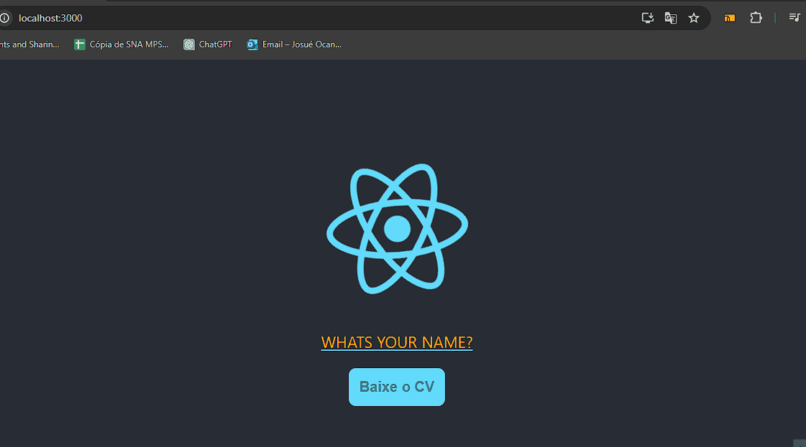

# Getting started Styling in components

Este projeto foi inicializado com [Create React App](https://github.com/facebook/create-react-app).

## About Project
#### Objetivo base, treino de React Básico.

* Criar um componente button que ao clicar exiba um alert com a mensagem "O label deste projeto é, BAIXAR CV"
* Criar um componente que estilize um paragrafo, a estilização deve ser, alterar cor do texto e transformar todo o texto em letras maiúsculas.

## Result

## Available Scripts

No diretório do projeto, você pode executar:

### `npm start`

Executa o aplicativo no modo de desenvolvimento.\
Abra [http://localhost:3000](http://localhost:3000) para visualizá-lo em seu navegador.

A página será recarregada quando você fizer alterações.\
Você também pode ver erros de lint no console.

### `npm test`

Inicia o executor de testes no modo de observação interativo.\
Consulte a seção sobre [execução de testes](https://facebook.github.io/create-react-app/docs/running-tests) para obter mais informações.

### `npm run build`

Cria o aplicativo para produção na pasta `build`.\
Ele agrupa corretamente o React no modo de produção e otimiza a construção para obter o melhor desempenho.

A compilação é reduzida e os nomes dos arquivos incluem os hashes.\
Seu aplicativo está pronto para ser implantado!

Consulte a seção sobre [implantação](https://facebook.github.io/create-react-app/docs/deployment) para obter mais informações.

### `npm run eject`

**Observação: esta é uma operação unidirecional. Depois de `ejetar`, você não pode voltar!**

Se você não estiver satisfeito com a ferramenta de construção e as opções de configuração, você pode `ejetar` a qualquer momento. Este comando removerá a dependência de compilação única do seu projeto.

Em vez disso, ele copiará todos os arquivos de configuração e as dependências transitivas (webpack, Babel, ESLint, etc) diretamente no seu projeto para que você tenha controle total sobre eles. Todos os comandos, exceto `eject`, ainda funcionarão, mas apontarão para os scripts copiados para que você possa ajustá-los. Neste ponto você está sozinho.

Você nunca precisa usar `eject`. O conjunto de recursos selecionados é adequado para implantações pequenas e médias e você não deve se sentir obrigado a usar esse recurso. No entanto, entendemos que esta ferramenta não seria útil se você não pudesse personalizá-la quando estiver pronto para isso.

